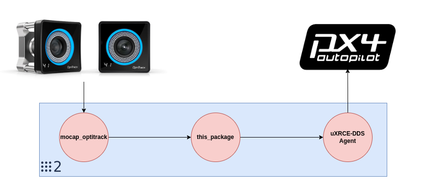

# Mocap-PX4 Bridge

<p align="center">
  
</p>

This ROS 2 Package takes the Position and Orientation measurements from OptiTrack system and send them to PX4 through the [uXRCE-DDS](https://docs.px4.io/main/en/middleware/uxrce_dds.html) bridge between ROS 2 and PX4.

## Complete Guideline

Please refer to [this document](./docs/PX4+Mocap+ROS2-Guide/Indoor%20Localization%20using%20OptiTrack%20and%20PX4_%20AeroSTREAM%20Workshop%20Guide.md) for a complete guidline of using PX4 with OptiTrack.

<p align="center">
  
</p>

## Pre conditions

> [!WARNING]  
> Check that the OptiTrack 'Up axis' is the Z-axis, in Motive the default is Y-axis

This package assumes that the OptiTrack system is broadcasting the position and orientation of the robot with the following reference frame convention:

* World frame: X axis Forward, Y-axis Left, Z-axis Up (Again: Check that the OptiTrack 'Up axis' is the Z-axis, in Motive the default is Y-axis).
* Body frame: X axis Forward, Y-axis Left, Z-axis Up.

## Getting started

We will create a ROS 2 workspace in `~/ros2_ws`, clone the required packages, build, and run:

```shell
mkdir -p ~/ros2_ws/src/
cd ~/ros2_ws/src/
git clone https://github.com/ros-drivers/mocap_optitrack.git
git clone https://github.com/SaxionMechatronics/mocap_px4_bridge.git
git clone https://github.com/PX4/px4_msgs.git
cd ~/ros2_ws
colcon build --symlink-install
source ~/ros2_ws/install/setup.sh
ros2 launch mocap_px4_bridge run.launch.py 
```

## Changing the topics names

By default:

1. This package will read the Optitrack measurements from the topic `/Robot_1/pose` 
2. Publish the measurements to the topic `/fmu/in/vehicle_visual_odometry`

To change the names of these topic, you need to edit the file `config/params.yaml`.

## Transforming to PX4 reference frame convention

Assuming that:

* `P_opti` is the position measurements from OptiTrack 
* `P_px4` is the position sent to PX4
* `q_opti` is the quaternion orientation measurements from OptiTrack
* `q_px4` is the quaternion sent to PX4. Here  

Here is how the frame conversion is carried out:
```python
P_px4.x =   P_optitrack.x​
P_px4.y = - P_optitrack.y​
P_px4.z = - P_optitrack.z​

q_px4.w =   q_px4.w​
q_px4.x =   q_px4.x ​
q_px4.y = - q_px4.y​
q_px4.z = - q_px4.z​
```
