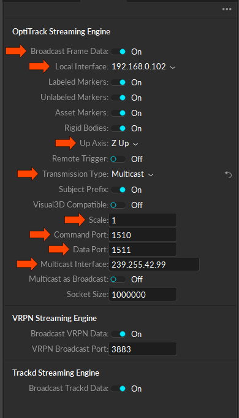
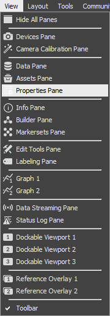
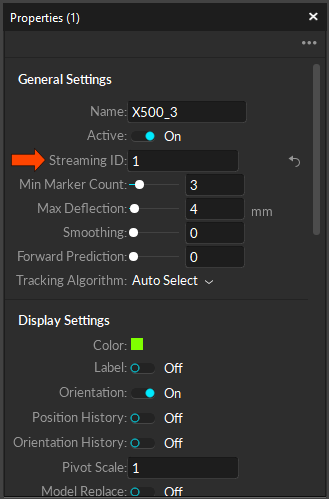
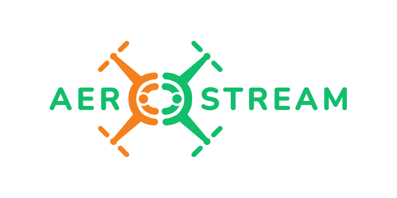

# Using OptiTrack with PX4 and ROS 2

In this tutorial-like guidline we will explain how to use OptiTrack pose measurements with PX4-powered drone using ROS 2.

<p align="center">
  
</p>

Contents
========

*   [Overview](#IndoorLocalizationusingOptiTrackandPX4:AeroSTREAMWorkshopGuide-Overview)
*   [Installation/setup](#IndoorLocalizationusingOptiTrackandPX4:AeroSTREAMWorkshopGuide-Installation/setup)
    *   [Motive/OptiTrack setup](#IndoorLocalizationusingOptiTrackandPX4:AeroSTREAMWorkshopGuide-Motive/OptiTracksetup)
        *   [Data-streaming](#IndoorLocalizationusingOptiTrackandPX4:AeroSTREAMWorkshopGuide-Data-streaming)
        *   [Creating a rigid body](#IndoorLocalizationusingOptiTrackandPX4:AeroSTREAMWorkshopGuide-Creatingarigidbody)
    *   [ROS 2 installation](#IndoorLocalizationusingOptiTrackandPX4:AeroSTREAMWorkshopGuide-ROS2installation)
        *   [ROS 2 Humble (Ubuntu 22.04)](#IndoorLocalizationusingOptiTrackandPX4:AeroSTREAMWorkshopGuide-ROS2Humble(Ubuntu22.04))
        *   [ROS 2 Foxy (Ubuntu 20.04)](#IndoorLocalizationusingOptiTrackandPX4:AeroSTREAMWorkshopGuide-ROS2Foxy(Ubuntu20.04))
    *   [ROS 2 Workspace setup](#IndoorLocalizationusingOptiTrackandPX4:AeroSTREAMWorkshopGuide-ROS2Workspacesetup)
        *   [Installation](#IndoorLocalizationusingOptiTrackandPX4:AeroSTREAMWorkshopGuide-Installation)
        *   [Configuration](#IndoorLocalizationusingOptiTrackandPX4:AeroSTREAMWorkshopGuide-Configuration)
    *   [Setup Micro XRCE-DDS Agent](#IndoorLocalizationusingOptiTrackandPX4:AeroSTREAMWorkshopGuide-SetupMicroXRCE-DDSAgent)
    *   [PX4 Setup](#IndoorLocalizationusingOptiTrackandPX4:AeroSTREAMWorkshopGuide-PX4Setup)
*   [Getting started](#IndoorLocalizationusingOptiTrackandPX4:AeroSTREAMWorkshopGuide-Gettingstarted)

Overview
========

The main components to use OptiTrack with PX4 are:

*   **Motive:** The software running on the computer connected directly to the OptiTrack system.
    
*   **ROS 2:** The framework in which the software linking OptiTrack and PX4 will run.
    
*   **Micro XRCE-DDS Agent:** This handles communication between ROS 2 and PX4, it communicates to the Micro XRCE-DDS Client running in PX4.
    
*   **natnet\_ros2:** Integration of the NatNet SDK for Optitrack and ROS2
    
*   **mocap\_px4\_bridge:** A ROS 2 package to convert incomming OptiTrack messages to messages that can be provided to PX4.

**Note:** Documentation updated as of 04.06.2024. to represent the changes in drivers and to provide easier setup 
    

Installation/setup
==================

Motive/OptiTrack setup
----------------------

### Data-streaming

1.  Open the data-streaming pane: “View” → “Data Streaming Pane”
    
    
2.  Show the advanced options: Click “_···”_ at the top right of the data streaming pane and then click “Show Advanced”
    
    
3.  In the datastreaming pane:
    
    1.  Enable `Broadcast Frame Data`
        
    2.  Set `local interface` to the network you want to receive the OptiTrack data on.
        
    3.  Set `Up Axis` to `Z Up`
        
    4.  Set `transmission` type to `multicast`, if the data is not received later, try setting to `unicast`
        
        

### Creating a rigid body

1.  Place the robot inside the OptiTrack working space.
    
2.  Make sure that the robot’s x-axis is aligned with the x-axis of the Optitrack system.
    
3.  **In Motive Software:** Select the markers.
    
4.  Right-click and select “Rigid Body” → “Create From Selected Markers”
    
    

5.  Open the properties pane by going to “View” → “Properties Pane”
    
    
6.  In the properties pane set the “Streaming ID” of the rigid body to a value from 1 to 9.
    
    
7.  Note the name of the rigid body used, it will be used later. For this demonstration it is set to `FSB_RigidBody`

ROS 2 installation
------------------

These instructions are adopted from the official ROS 2 documentation but added here for completeness.

### ROS 2 Humble (Ubuntu 22.04)

Source: [https://docs.ros.org/en/humble/Installation/Ubuntu-Install-Debians.html](https://docs.ros.org/en/humble/Installation/Ubuntu-Install-Debians.html)

1.  Make sure you are using a locale which supports UTF-8
    

```bash
sudo apt update && sudo apt install locales
sudo locale-gen en_US en_US.UTF-8
sudo update-locale LC_ALL=en_US.UTF-8 LANG=en_US.UTF-8
export LANG=en_US.UTF-8
```

2.  Add the ROS 2 apt repository
    

```bash
sudo apt install software-properties-common
sudo add-apt-repository universe
sudo apt update && sudo apt install curl -y
sudo curl -sSL https://raw.githubusercontent.com/ros/rosdistro/master/ros.key -o /usr/share/keyrings/ros-archive-keyring.gpg
echo "deb [arch=$(dpkg --print-architecture) signed-by=/usr/share/keyrings/ros-archive-keyring.gpg] http://packages.ros.org/ros2/ubuntu $(. /etc/os-release && echo $UBUNTU_CODENAME) main" | sudo tee /etc/apt/sources.list.d/ros2.list > /dev/null
```

3.  Install ROS 2 packages
    

```bash
sudo apt update && sudo apt upgrade -y
sudo apt install ros-humble-desktop
sudo apt install ros-dev-tools
source /opt/ros/humble/setup.bash && echo "source /opt/ros/humble/setup.bash" >> .bashrc
```

### ROS 2 Foxy (Ubuntu 20.04)

Source: [https://docs.ros.org/en/foxy/Installation/Ubuntu-Install-Debians.html](https://docs.ros.org/en/foxy/Installation/Ubuntu-Install-Debians.html)

1.  Make sure you are using a locale which supports UTF-8
    

```bash
sudo apt update && sudo apt install locales
sudo locale-gen en_US en_US.UTF-8
sudo update-locale LC_ALL=en_US.UTF-8 LANG=en_US.UTF-8
export LANG=en_US.UTF-8
```

2.  Add the ROS 2 apt repository
    

```bash
sudo apt install software-properties-common
sudo add-apt-repository universe
sudo apt update && sudo apt install curl -y
sudo curl -sSL https://raw.githubusercontent.com/ros/rosdistro/master/ros.key -o /usr/share/keyrings/ros-archive-keyring.gpg
echo "deb [arch=$(dpkg --print-architecture) signed-by=/usr/share/keyrings/ros-archive-keyring.gpg] http://packages.ros.org/ros2/ubuntu $(. /etc/os-release && echo $UBUNTU_CODENAME) main" | sudo tee /etc/apt/sources.list.d/ros2.list > /dev/null
```

3.  Install ROS 2 packages
    

```bash
sudo apt update && sudo apt upgrade -y
sudo apt install ros-foxy-desktop
sudo apt install ros-dev-tools
source /opt/ros/foxy/setup.bash && echo "source /opt/ros/foxy/setup.bash" >> .bashrc
```

ROS 2 Workspace setup
---------------------

### Installation

1.  Create a directory for you workspace
    

```bash
mkdir -p ~/ros2_ws/src/
```

2.  Clone the natnet\_ros2, mocap\_px4\_bridge and px4\_msgs package to your workspace.
    

```bash
cd ~/ros2_ws/src/
git clone https://github.com/Raphtor/natnet_ros2.git
git clone https://github.com/SaxionMechatronics/mocap_px4_bridge.git
git clone https://github.com/PX4/px4_msgs.git
```

3.  Download and configure the NatNet SDK
```bash
cd ~/ros2_ws/src
mkdir NatNet_SDK_4.0_ubuntu
cd NatNet_SDK_4.0_ubuntu
wget https://s3.amazonaws.com/naturalpoint/software/NatNetSDKLinux/ubuntu/NatNet_SDK_4.0_ubuntu.tar
wget -O ~/ros2_ws/src/natnet_ros2/src/client.cpp https://github.com/Zredy/mocap_px4_bridge/raw/master/docs/PX4+Mocap+ROS2-Guide/attachments/client.cpp
```

4.  Extract the files and copy the necessary files to their locations
```bash
tar -xvf NatNet_SDK_4.0_ubuntu.tar
cd ~/ros2_ws/src
cp NatNet_SDK_4.0_ubuntu/lib/libNatNet.so natnet_ros2/lib/ && cp NatNet_SDK_4.0_ubuntu/include/NatNet* natnet_ros2/include/natnet
rm -rf NatNet_SDK_4.0_ubuntu*
```

5.  Build
    

```bash
cd ~/ros2_ws/
colcon build --symlink-install
```

6.  Source the packages
    

```bash
source ~/ros2_ws/install/setup.sh
```

You need to do this in every new terminal you open, you can also automate this by adding it to your `.bashrc` using: `echo "source ~/ros2_ws/install/setup.sh" >> .bashrc`

### Configuration

Open the configuration mocap\_px4\_bridge configuration file (`~/ros2_ws/src/mocap_px4_bridge/config/params.yaml`) in a text editor.

Here you can change the name of the rigid body to the one put into Motive
To do so, change the `mocap_topic` line to suit your rigid body name,
for example: `mocap_topic: /YOUR_RIGID_BODY/pose_stamped`
    
The default is `FSB_RigidBody`:
```yaml
/mocap_px4_bridge:
  ros__parameters:
    mocap_topic: /FSB_RigidBody/pose_stamped
    px4_topic: /fmu/in/vehicle_visual_odometry
```

Setup Micro XRCE-DDS Agent
--------------------------

The Micro XRCE-DDS Agent and client serve as a bridge between ROS2 and PX4, the agent needs to be build and installed on your computer.

This can be done like this:

```bash
git clone https://github.com/eProsima/Micro-XRCE-DDS-Agent.git
cd Micro-XRCE-DDS-Agent
mkdir build
cd build
cmake ..
make
sudo make install
sudo ldconfig /usr/local/lib/
```

PX4 Setup
---------

Open [QGroundControl](https://docs.qgroundcontrol.com/master/en/getting_started/download_and_install.html) and connect the Pixhawk to your computer using a USB cable. Navigate to Vehicle Setup → Parameters, then:

|**Parameters** | **Values** |
| --- | --- |
| `UXRCE_DDS_CFG`| a desired port on your flight controller (eg. `TELEM 2`)|
| `ser_tel2_baud`| `921600`|
| `EKF2_EV_CTRL` | Select `horizontal position fusion`, `vertical vision fusion`, and `yaw fusion`. |
| `EKF2_HGT_REF` | Set to `Vision` to use the vision as the reference source for altitude estimation. |
| `EKF2_EV_POS_X,Y,Z` | For more accuracy: Set the position of the vision sensor (or MoCap markers) with respect to the robot's body frame. |
| `EKF2_GPS_CTRL`| Disable GPS sensor fusion|
| `EKF2_BARO_CTRL`| Disable Barometer sensor fusion|
| `EKF2_RNG_CTRL`| Disable range finder sensor fusion|

Getting started
===============

On the PC that is connected to the network that is streaming the OptiTrack data.

Note to source the file in any new terminal before executing the commands to come:
```bash
source ~/ros2_ws/install/setup.sh
```

In one terminal, start the Micro XRCE-Agent

```bash
sudo MicroXRCEAgent serial --dev /dev/ttyUSB0 -b 921600
```

In the second terminal, start the NatNet Optitrack to ROS2 driver

```bash
ros2 run natnet client
```

In the third terminal, start the OptiTrack client and PX4 bridge

```bash
ros2 launch mocap_px4_bridge run.launch.py
```

If you want to monitor the data received by ROS2, in a new terminal run:
```bash
ros2 topic echo /fmu/out/vehicle_odometry
```

Acknowledgment
===============

This training material was prepared and delivered as part of the Horizon Europe CSA project: AeroSTREAM (Grant Agreement number: 101071270).
<p align="center">
  
</p>